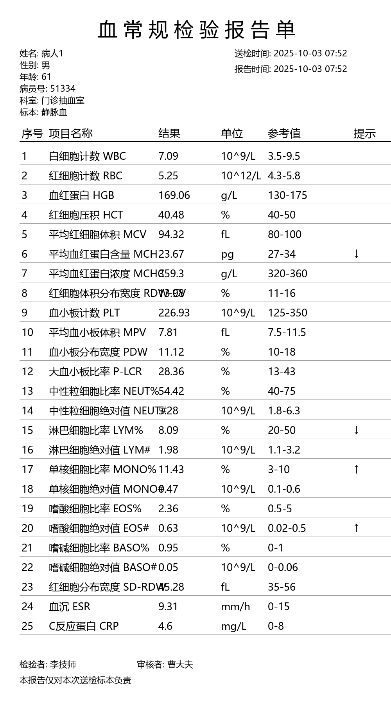

# Blood Test Report Generator

A Python-based synthetic blood test report generator designed for creating realistic Complete Blood Count (CBC) reports for computer vision and VLM model training.

## 🎯 Project Overview

Medical test reports are highly sensitive personal data that are difficult to collect in large quantities. This project provides an efficient solution for generating synthetic blood test reports to support the training of Visual Language Models (VLMs) and computer vision applications.

## 📊 Features

### Dual Generation Modes
- **Single Column Layout** (`generate_one_col.py`): Classic vertical layout with 25 standard CBC parameters
- **Two Column Layout** (`generate_two_cols.py`): Modern dual-column layout with enhanced patient information

<div style="display: flex; justify-content: space-between;">
  
  
</div>

### Key Capabilities
- ✅ **Realistic Medical Data**: Generates clinically accurate blood test values with proper reference ranges
- ✅ **Patient Information**: Synthetic patient data including name, gender, age, medical record numbers
- ✅ **Abnormal Values**: Controlled generation of abnormal values (↑/↓ indicators) for model training
- ✅ **Chinese Language Support**: Authentic Chinese medical report formatting
- ✅ **Batch Generation**: Generate multiple reports in one execution
- ✅ **High-Quality Images**: A4-sized reports with professional typography

## 🏥 Medical Parameters

The generator covers 25 standard Complete Blood Count (CBC) parameters:

| Parameter | Chinese Name | Unit | Normal Range |
|-----------|--------------|------|--------------|
| WBC | 白细胞计数 | 10^9/L | 3.5-9.5 |
| RBC | 红细胞计数 | 10^12/L | 4.3-5.8 |
| HGB | 血红蛋白 | g/L | 130-175 |
| PLT | 血小板计数 | 10^9/L | 125-350 |
| NEUT% | 中性粒细胞比率 | % | 40-75 |
| LYM% | 淋巴细胞比率 | % | 20-50 |
| ... and 19 more parameters | | | |

## 🚀 Quick Start

### Prerequisites
```bash
pip install Pillow faker
```

### Single Column Reports
```bash
python generate_one_col.py
```

### Two Column Reports
```python
python generate_two_cols.py
```

## 📁 Project Structure

```
.
├── generate_one_col.py     # Single column report generator
├── generate_two_cols.py    # Two column report generator
└── README.md              # This file
```

## 🎨 Output Examples

### Single Column Layout
- Professional medical report header
- Patient information section
- 25-parameter table with sequential numbering
- Normal/abnormal value indicators (↑/↓)
- Medical staff signatures and timestamps

### Two Column Layout
- Modern dual-column design
- Enhanced patient data with Faker-generated information
- Split parameter display (left/right columns)
- Barcode and medical record numbers
- Clinical diagnosis information

## 🔧 Technical Details

### Image Specifications
- **Resolution**: A4 size (2480×1748 pixels for two-column, 1000×1800 for single-column)
- **Format**: PNG with high DPI (200 DPI)
- **Fonts**: Automatic Chinese font detection (SimSun, Microsoft YaHei, SimHei)

### Data Generation
- **Value Distribution**: 80% normal values, 20% abnormal values
- **Gender-specific Ranges**: Different reference ranges for male/female patients
- **Realistic Variations**: Natural value fluctuations within clinical ranges

## 💡 Use Cases

### Machine Learning Applications
- **VLM Training**: Generate large datasets for visual language model training
- **OCR Development**: Test and train optical character recognition systems
- **Document Understanding**: Develop models for medical document analysis
- **Data Augmentation**: Supplement real medical data for model training

### Research & Education
- Medical education and training materials
- Healthcare application development
- Privacy-preserving medical data research

## 🔒 Privacy & Ethics

This tool is designed specifically for:
- **Research purposes** where real medical data is unavailable
- **Model training** without using actual patient information
- **Educational applications** that require realistic medical documents

**Important**: Generated reports contain synthetic data and should not be used for actual medical diagnosis or treatment.

## 🤝 Contributing

Contributions are welcome! Please feel free to submit pull requests for:
- Additional medical parameters
- Improved report layouts
- Support for other languages
- Enhanced data generation algorithms

## 📄 License

This project is open source and available under the MIT License.

## 🙏 Acknowledgments

- Medical reference ranges based on standard clinical guidelines
- Chinese font support for authentic medical document appearance
- Faker library for realistic patient data generation

---


**Note**: This tool generates synthetic medical data for research and development purposes only. Always consult qualified healthcare professionals for medical diagnosis and treatment.
